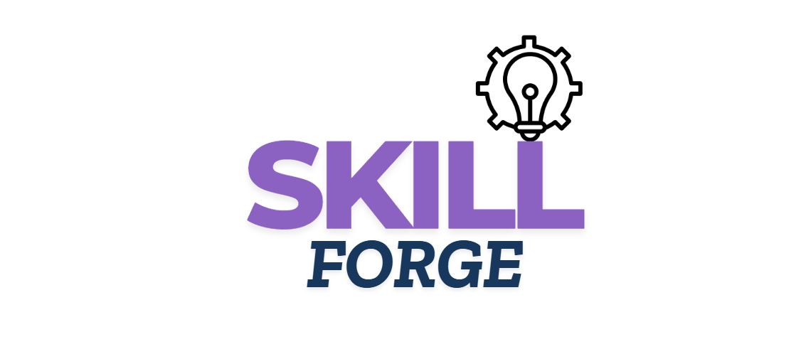
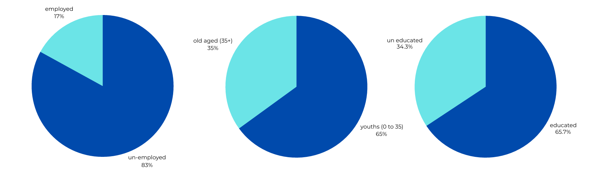
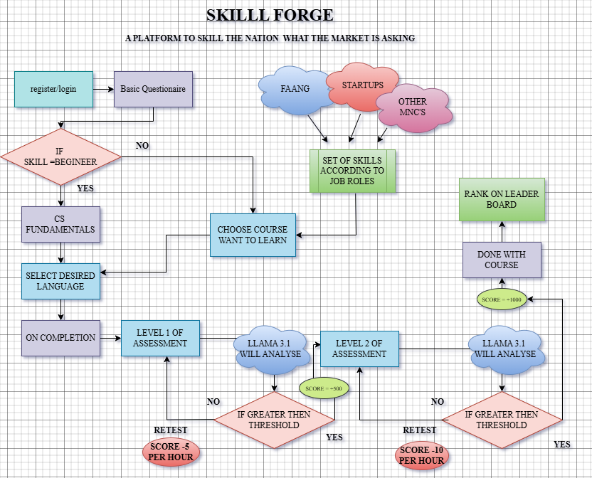

# Skill Forge 🚀

[](https://opensource.org/licenses/MIT)

**Forging India's Future: An Adaptive, Inclusive Skilling Platform for India's Youth**

Skill Forge, crafted by **Team SuryaPrabha** (Team Leader: Vinayak Shinde), is an innovative platform tackling India’s skilling crisis. It empowers youth with industry-ready tech skills through real-time relevance, offline-first inclusivity, and gamified learning, addressing unemployment and employability gaps.

---

## The Need: Why Skill Forge? 😟

India faces a skilling emergency:
- **Youth Unemployment Crisis**: 83% of the unemployed are youth (aged 0-35), with 65.7% educated yet jobless (ILO 2024).
- **Skill Gap**: Academic curricula lag behind dynamic industry demands (e.g., FAANG, startups, MNCs).
- **Employability Failure**: ~50% of graduates are unemployable due to outdated skills.
- **Accessibility Barriers**: Limited internet, basic devices, and low engagement hinder skilling in Tier 2/3 cities and rural areas.

**The Problem**: Current solutions lack relevance, accessibility, and engagement, leaving millions unprepared for the job market.

---

## Our Solution: Skill Forge ✨

Skill Forge bridges these gaps with a unique, scalable approach:
1. **Real-Time Industry Alignment**: Scrapes job listings (e.g., FAANG, MNCs) to deliver hyper-relevant courses (AI, SWE, Data Science).
2. **Offline-First Inclusivity**: Robust offline access (PWA/Desktop/Mobile) for learning, coding, and feedback, with multi-lingual support.
3. **Gamified Engagement**: Mario-inspired levels, Aura Points, and leaderboards boost motivation.
4. **Hybrid AI Evaluation**: On-device AI (TensorFlow Lite) for offline feedback; cloud AI (Llama 3) for advanced online analysis.
5. **Personalized Learning**: Adapts to user skill levels and career goals.

**USP**: Combines real-time skill mapping, deep inclusivity, and practical, AI-driven learning—unlike static, online-only platforms.

**Intended Impact**:
- Bridges skill gaps for FAANG/MNC jobs.
- Boosts employability in underserved regions.
- Drives digital inclusion with offline access.
- Strengthens India’s tech ecosystem with skilled innovators.

---

## Core Features 💡

- **👤 Personalized Onboarding**: Skill assessments and tailored paths.
- **⚙️ Dynamic Curriculum**: Multi-level courses updated via job data.
- **📲 Offline Learning**: Downloadable modules, offline coding, basic feedback.
- **🎮 Gamification**: Levels, Aura Points, engaging visuals.
- **🤖 AI Evaluation**: Offline (TF Lite) and online (Llama 3) project analysis.
- **🌐 Multi-Lingual**: Regional language support (e.g., Hindi, Telugu, Marathi).
- **📊 Skills Dashboard**: Real-time industry skill insights.
- **📈 Progress Tracking**: Leaderboards and personal metrics.

---

## Project Flow 🌊

1. Onboarding → Skill Assessment
2. Course Selection (market-aligned)
3. Multi-Level Learning + Assessments
4. Gamified Rewards (Aura Points)
5. AI-Driven Project Feedback



---

## Architecture Overview 🏗️

Skill Forge employs a **modular, hybrid architecture**:
- **UI Layer**: Mobile-first PWA (React), Desktop (Electron), offline via IndexedDB.
- **AI Layer**: TensorFlow Lite (offline, <100 MB) + Llama 3 (cloud, AWS Lambda).
- **Data Layer**: Local (IndexedDB) for offline; PostgreSQL (AWS RDS) for sync.
- **Connectivity**: Low-bandwidth design, differential sync, offline queue.
- **Ethics**: Transparent AI, bias audits, open-source community support.


---

## Tech Stack 💻

### Core Technologies
- **Backend**: Python, Flask (lightweight API framework).
- **Web Scraping**: BeautifulSoup, Requests (job data extraction).
- **AI/ML**:
  - **Meta Llama 3**: Cloud-based, advanced project evaluation.
  - **TensorFlow Lite**: On-device, lightweight code analysis.
  - **Scikit-learn**: Future personalization tasks.
- **Frontend**:
  - **PWA**: HTML/CSS/JS, React (mobile-first, offline-ready).
  - **Desktop App**: Electron (offline learning platform).
  - **Mobile**: React Native (optimized experience).
- **Offline/Sync**: Service Workers, IndexedDB (caching and sync).
- **Database**: PostgreSQL (cloud-hosted profiles and skills).

### Why Open-Source?
- **Cost-Effective**: No licensing fees, enabling wide access.
- **Customizable**: Tailored for offline use and Indian needs.
- **Community-Driven**: Rapid innovation via Python, AI, and web communities.
- **Specialized**: Llama 3 (powerful LLMs), TF Lite (lightweight ML) suit hybrid needs.

---

## Getting Started 🛠️

### Prerequisites
- Python 3.x, pip, Git

### Steps
1. **Clone the Repository**:
   ```bash
   git clone https://github.com/vinayak1729-web/skill-forge.git
   cd skill-forge
   ```
2. **Set Up Virtual Environment**:
   ```bash
   python -m venv venv
   source venv/bin/activate  # Windows: venv\Scripts\activate
   ```
3. **Install Dependencies**:
   ```bash
   pip install -r requirements.txt
   ```
4. **Run the Backend**:
   ```bash
   flask run
   ```
5. **Access the Frontend**:
   - Open `index.html` (PWA) or launch via Electron/React Native.

---

## Usage 🖱️

- **Frontend**: Access via web, desktop, or mobile app.
- **API**: Use endpoints like `/scrape/<company>` for skill data.

---

## Contributing 🤝

We welcome contributions! Follow these steps:
1. Fork the repo.
2. Create a branch (`git checkout -b feature/YourFeature`).
3. Commit changes (`git commit -m "Add YourFeature"`).
4. Push (`git push origin feature/YourFeature`).
5. Open a Pull Request.

---

## License 📄

Distributed under the MIT License. See `LICENSE` for details.

---

## Contact 📫

**Team SuryaPrabha**  
Team Leader: Vinayak Shinde  
Email: [shindevinayak233@gmail.com]  
GitHub: [Vinayak Shinde](https://github.com/vinayak1729-web)
